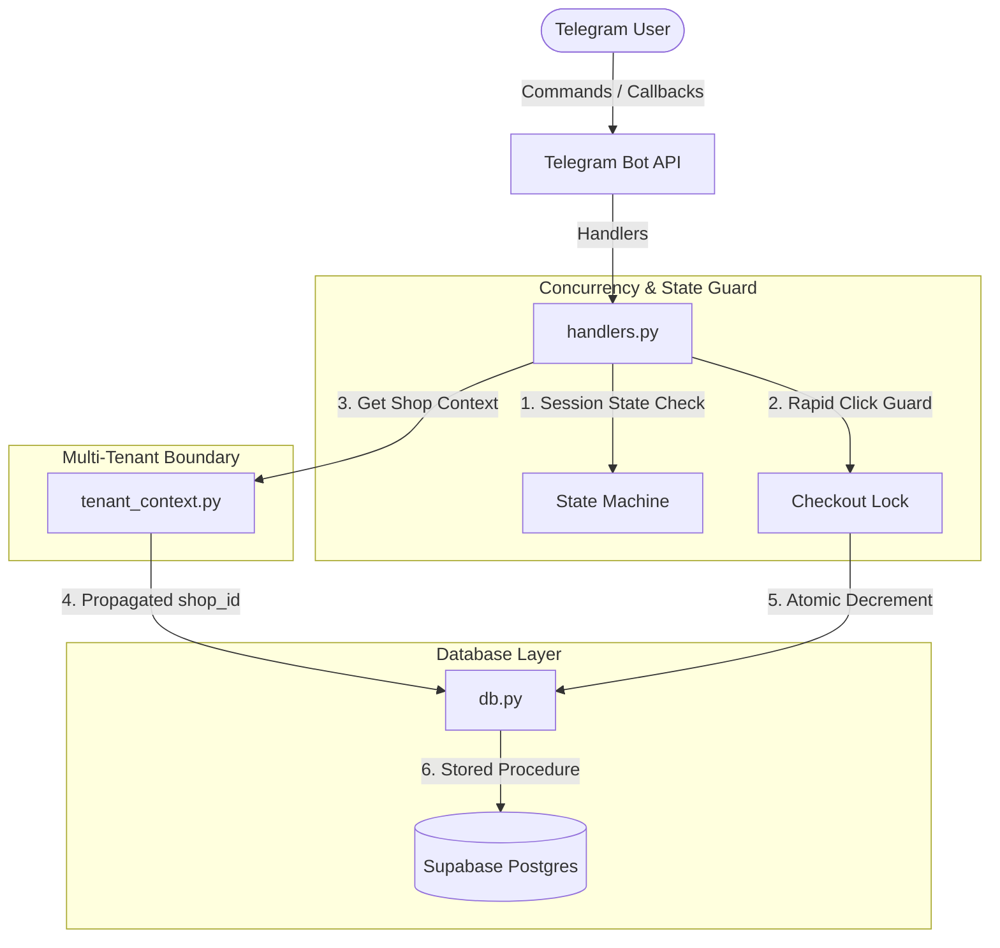

# YourCloser — Version 2.0.0 (Production-Grade Concurrency & Multi-Tenant Hardening)

This document provides a highly detailed breakdown of the Version 2.0.0 stability, predictability, and multi-tenant security architecture implemented in the YourCloser Telegram Bot.

---

## 🏛️ System Architecture Overview



---

## 🔒 1. Session State Machine & Checkout Lock (`handlers.py`)

To prevent duplicate submissions, race conditions, and accidental double-orders, the handler layer enforces a state machine and a distributed lock per user session.

### A. The User State Machine
Every user's interaction transitions through explicit states to guarantee sequence predictability:
* **`idle` / `browsing`:** The user is looking at categories, scrolling products, or viewing details.
* **`checking_out`:** The user has clicked "Checkout" and is filling out their delivery profile details.
* **`processing`:** The order is undergoing verification and final database committing. Transitions are locked during this state to prevent duplicate calls.

### B. The Anti-Spam Checkout Lock
When a user clicks "Confirm Order", they can sometimes trigger multiple callbacks (e.g., due to lag or double-clicking). The lock mechanisms protect this critical path:
```python
_order_locks = set()

def acquire_order_lock(user_id: int) -> bool:
    """Acquire a temporary memory lock for a user to block double-spend/rapid clicks."""
    if user_id in _order_locks:
        return False
    _order_locks.add(user_id)
    return True

def release_order_lock(user_id: int) -> None:
    """Release the user's order lock."""
    _order_locks.discard(user_id)
```
* **Thread-Safety:** Prevents rapid-click duplication within millisecond windows.
* **Graceful Failure:** Any callback received while a lock is held is discarded instantly without spamming the user.

---

## 🌐 2. Robust Multi-Tenant Boundary (`tenant_context.py`)

YourCloser operates as a multi-tenant platform where a single bot instance serves multiple shops dynamically. Tenant isolation is enforced through a strict extraction hierarchy.

### The Extraction Priority Chain
The shop context (`shop_id`) is extracted dynamically for every request following this trust hierarchy:
1. **Deep Link Parameter (`/start <shop_id>`):** Extracted on first contact. Highest confidence source of truth.
2. **PTB Parse Command Arguments (`context.args`):** Parsed directly from message payloads.
3. **Session Cache (`context.user_data["shop_id"]`):** Fallback cache maintained throughout the session.
4. **Resilient Fallback (`default`):** If no context is found, logs a high-priority warning (`logger.warning`) to trace leakage, then defaults safely to `"default"` without crashing.

---

## 🛢️ 3. Hardened Database Layer (`db.py`)

All Supabase query layers have been refactored to eliminate tenant leakage and resolve race conditions during stock reduction.

### A. Strict Signature Enforcement
Every single query, retrieval, and insert function in `db.py` now enforces a **required, non-optional** `shop_id` argument. If any developer attempts to call a database function without specifying a shop context, python raises a compile/runtime error instantly.

### B. Atomic Stock Decrement via PostgreSQL RPC
Legacy versions retrieved stock, subtracted 1 in memory, and pushed the update. This caused race conditions where two users could purchase the last remaining item. Version 2.0.0 resolves this by using an atomic database stored procedure (`decrement_stock_atomic`):

```sql
CREATE OR REPLACE FUNCTION decrement_stock_atomic(stock_id UUID)
RETURNS SETOF stock AS $$
BEGIN
    RETURN QUERY
    UPDATE stock
    SET quantity = quantity - 1,
        updated_at = NOW()
    WHERE id = stock_id AND quantity > 0
    RETURNING *;
END;
$$ LANGUAGE plpgsql;
```

**Why it's secure:**
* The subtraction is executed in a single atomic SQL transaction.
* If another request reduces the quantity to `0` first, the subsequent transaction fails the `quantity > 0` condition, returning an empty set.
* The Python layer checks `result.data`—if empty, the transaction rolls back, and the user is immediately notified that the item is sold out.

---

## ⚡ 4. Applied SQL Migrations Reference

### `migration_v4.sql` (Multi-Tenant Infrastructure)
Adds target fields and performance indexes:
```sql
ALTER TABLE products ADD COLUMN IF NOT EXISTS shop_id TEXT DEFAULT 'default';
ALTER TABLE orders ADD COLUMN IF NOT EXISTS shop_id TEXT DEFAULT 'default';

CREATE INDEX IF NOT EXISTS idx_products_shop_id ON products(shop_id);
CREATE INDEX IF NOT EXISTS idx_orders_shop_id ON orders(shop_id);

UPDATE products SET shop_id = 'default' WHERE shop_id IS NULL;
UPDATE orders SET shop_id = 'default' WHERE shop_id IS NULL;
```

### `migration_v5.sql` (Atomic Concurrency Engine)
Registers the stock decrement stored procedure:
```sql
CREATE OR REPLACE FUNCTION decrement_stock_atomic(stock_id UUID)
RETURNS SETOF stock AS $$
BEGIN
    RETURN QUERY
    UPDATE stock
    SET quantity = quantity - 1,
        updated_at = NOW()
    WHERE id = stock_id AND quantity > 0
    RETURNING *;
END;
$$ LANGUAGE plpgsql;
```

---

## 🧪 5. Automated Chaos & Validation Suite (`chaos_test.py`)

To guarantee these protections are active, a custom chaos testing engine runs **36 rigorous validation tests** checking import paths, state locks, multi-tenant boundaries, and heavy async concurrency.

### Test Coverage Detail

| Test Suite | Objective | Outcome |
| :--- | :--- | :--- |
| **Test 1: Import Validation** | Ensures all dependencies, database configurations, and handler routines compile cleanly. | **PASSED** ✅ |
| **Test 2: Checkout Lock** | Verifies first-lock acquisition, duplicate lock blocking, and lock releasing. | **PASSED** ✅ |
| **Test 3: Rapid Click Spam** | Fires 10 simultaneous clicks within a loop and ensures exactly 1 goes through. | **PASSED** ✅ |
| **Test 4: Signature Enforcements** | Uses Python's `inspect` library to parse all 19 `db.py` functions, ensuring `shop_id` is required. | **PASSED** ✅ |
| **Test 5: Legacy Removal** | Verifies that old, unsafe `decrement_stock` routines have been fully purged. | **PASSED** ✅ |
| **Test 6: Alias Mapping** | Verifies compatibility alias matching for legacy calls. | **PASSED** ✅ |
| **Test 7: Tenant Guard Fallbacks** | Simulates missing context scenarios to verify logging warning fallbacks. | **PASSED** ✅ |
| **Test 8: Integrity Checks** | Scrapes the `handlers.py` source code to verify no unsafe references remain. | **PASSED** ✅ |
| **Test 9: Async Concurrency Lock** | Spawns 20 concurrent async workers attempting to acquire the lock at once. | **PASSED** ✅ |

### Running the Test Suite
To execute the validation tests, run the following commands inside the `bot/` folder:
```powershell
$env:PYTHONIOENCODING="utf-8"
python chaos_test.py
```
